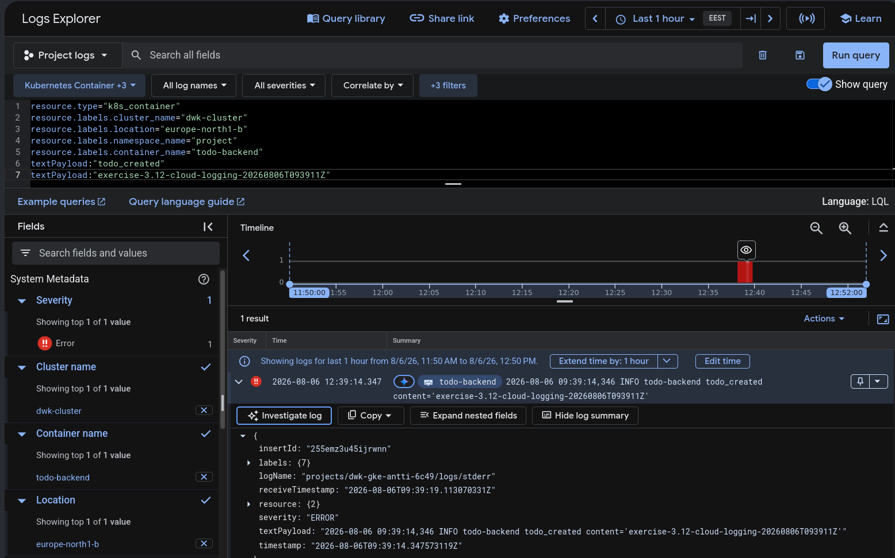

# Todo backend

FastAPI backend for the Todo application. Todos and their done state are stored in PostgreSQL. `GET /todos` lists todos and `PUT /todos/<id>` marks a todo done. Todo creation and update events are published to NATS for the broadcaster service. Todo requests are logged, and todos longer than 140 characters are rejected. `GET /healthz` checks application and database health, and `POST /break` marks the process unhealthy.

A CronJob creates an hourly todo for a random Wikipedia article. Production has a daily CronJob that saves PostgreSQL dumps to a separate persistent volume. Staging has no database backup job.

PostgreSQL runs as a single-replica StatefulSet. Database settings are provided through a ConfigMap and a SOPS-encrypted Secret.

## Secrets and deployment

The staging and production overlays deploy the backend, PostgreSQL and CronJobs through Argo CD. See the Todo app README for GitOps setup.

Provision the database Secret in each environment before synchronization:

```bash
export SOPS_AGE_KEY_FILE="$HOME/.config/sops/age/keys.txt"

for namespace in staging production; do
  sops --decrypt todo-backend/manifests/secret.enc.yaml \
    | sed "s/namespace: project/namespace: $namespace/" \
    | kubectl apply -n "$namespace" -f -
done
```

Production backups are stored in the `todo-backups` PVC. These local volumes survive Pod restarts but do not protect against loss of the cluster or host. The standalone `manifests/backup-cronjob.yaml` provides the GCS variant and requires a `storage-sa-key` Secret containing `key.json` and an enabled Google Cloud billing account.

## Exercise 3.9: DBaaS vs DIY

### Database as a Service

**Pros**

- The database can be set up quickly because the server, storage and database installation are provided by the cloud provider.
- Routine maintenance, security patches and many version upgrades are handled by the provider.
- Automated backups and point-in-time recovery can usually be enabled with only a few configuration choices.
- High availability, monitoring and storage expansion can be added relatively easily.

**Cons**

- A managed database usually costs more than a small PostgreSQL instance running in an existing Kubernetes cluster.
- Backups, high availability and network traffic may increase the monthly cost further.
- Less control is available over the database server, supported versions and extensions.
- Greater dependency on the chosen cloud provider is introduced.

### Self-hosted PostgreSQL in Kubernetes

**Pros**

- Direct infrastructure costs can be lower because the existing Kubernetes nodes and storage can be used.
- Full control is retained over the PostgreSQL version, configuration and extensions.
- The setup can be moved more easily between different Kubernetes environments.
- The solution is suitable for a small course project where high availability is not required.

**Cons**

- More initial setup work is required because the StatefulSet, persistent storage, networking, credentials and health checks must be configured.
- Database updates, security patches, monitoring, storage capacity and failure recovery must be handled separately.
- Backups must be implemented, for example with `pg_dump`, a CronJob and external object storage.
- Backup retention, restoration and restore testing must also be planned and maintained.
- High availability is not provided by a single PostgreSQL Pod and persistent volume.

For this course project, self-hosted PostgreSQL is a reasonable and inexpensive choice. For a production service where availability and recovery are important, a managed database would reduce the amount of maintenance required.

## Exercise 3.12: GKE application logs


